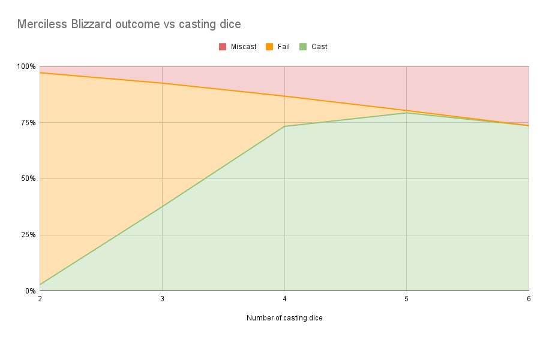
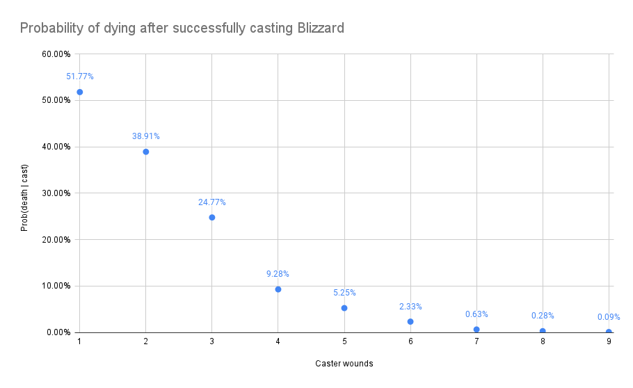
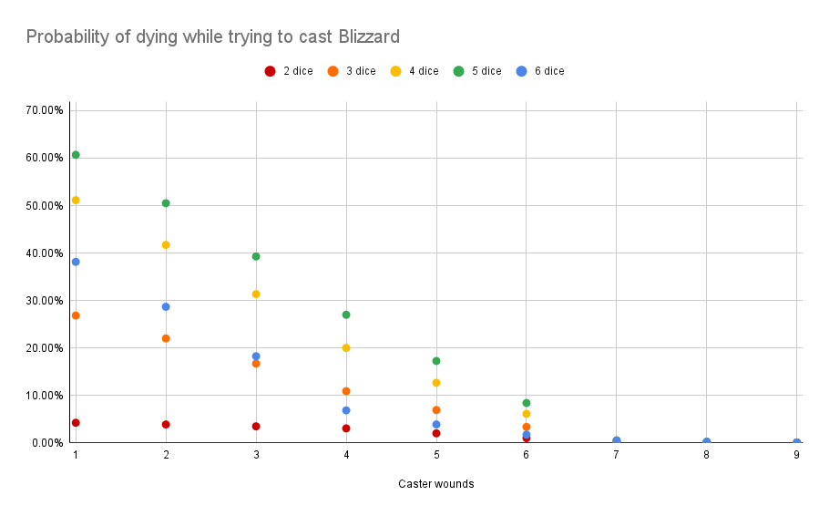

# aos-dice

Utilities for working with dice rolls relevant to _Warhammer Age of Sigmar_ (AoS).

The main thing here at the moment are functions for answering questions like:

- _What is the probability of rolling at least `n` on `k` `s`-sided dice_? (`rollAtLeast s n k`)
- _What is the probability of rolling at least `n` on `k` `s`-sided dice while rolling exactly `i`
  ones?_ (`rollAtLeastWithExactlyOnes s n k i`)

These probabilities turn out to be not super straight-forward to calculate analytically on paper!

In AoS, probabilities like this are relevant when working out the probability of casting _Merciless
Blizzard_ without miscasting, or the probability of taking 6 wounds after successfully casting
merciless blizzard and rolling 3 ones (`rollAtLeast 3 6 3`).

## Usage

If you have Haskell `stack` installed you can do:

```
stack repl
```

## Merciless Blizzard

Probability of different outcomes when trying to cast _Merciless Blizzard_ with different numbers of
dice. Number of dice includes 2 casting dice + primals.



---

Probability of dying after successfully casting _Merciless Blizzard_. This sums across the
probabilities for dying after rolling one 1, two 1s, three 1s, four 1s.



---

Probability of dying while trying to cast _Merciless Blizzard_. This includes the probability
of dying due to a miscast, and the probability of dying after casting successfully.



Full working for the above graphs can be found here: https://docs.google.com/spreadsheets/d/1F7rOtOoK0gopx8QReRkw0mT89cm22F5FeRm4RIYQxLE
